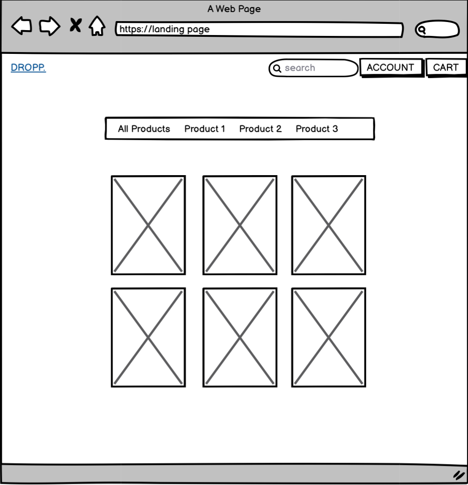
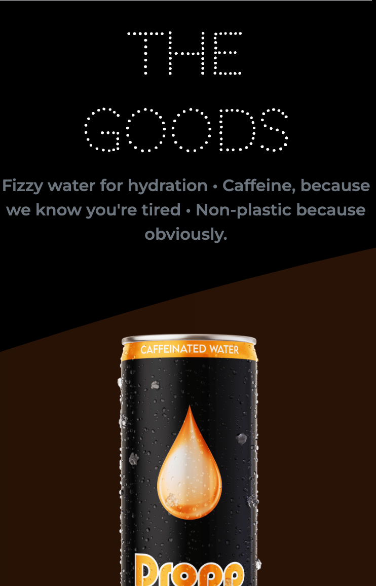
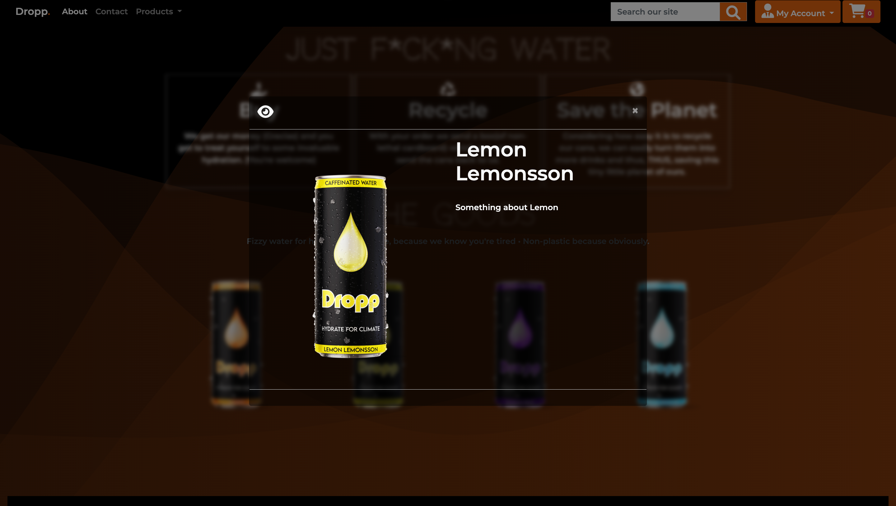
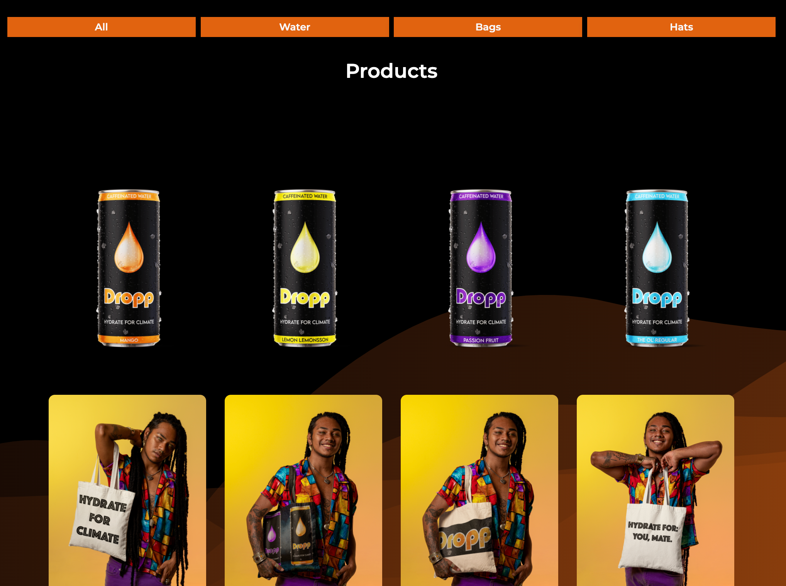
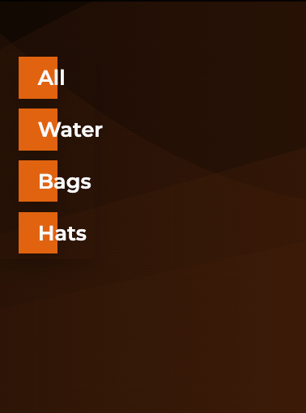
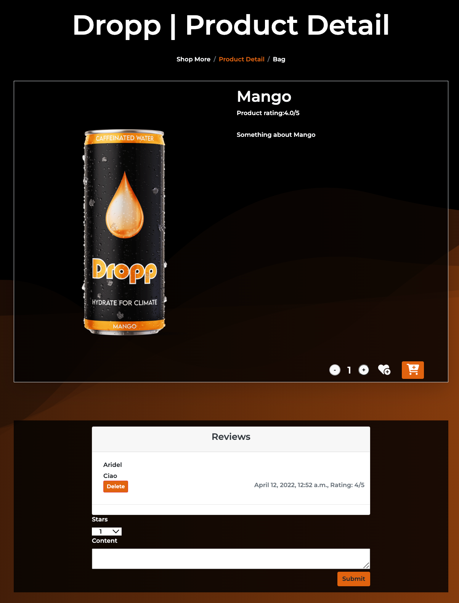
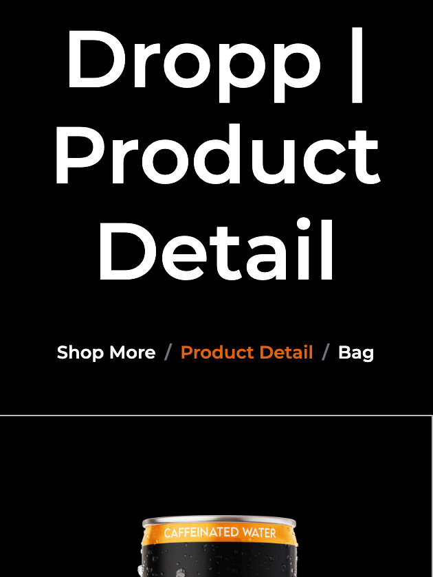

# canned-water

Welcome to Dropp. Website! Dropp is an ecommerce platform, equipped with authentication (user-accounts) that not only sells its brand but also sells their products and merchandise. All using HTML, CSS(bootstrap), Javascript(jQuery), Python, Django, and deployment to Heroku with AWS holding the reigns of static files. Not to mention Stripe, the payment system integrated.

Live link: https://quarrel2022.herokuapp.com/

## About:

### Table of Contents

1. [User Stories](#user-stories)
2. [UX](#ux)
   1. [Strategy](#strategy)
   2. [Design/Structure](#design/structure)
   3. [Databases](#databases)
   4. [Planning](#planning)
   5. [End Design](#end-design-result)
3. [Testing](#testing)
   1. [Manual Testing](#manual-testing)
   2. [Validator](#validator-testing)
   3. [Bugs](#unfixed-bugs)
   4. [Improvements](#improvements)
4. [Credits](#credits)

### User Stories

View my User Stories and planning [here](https://github.com/Marcroth0/relationship-quarrel/issues).

# UX

## Strategy

The initial and primary goal of the website is to create an e-commerce platform that looks great. This is not 100% dedicated to ecommerce, but to the brand itself. Sell the brand, sell the product. It allows a user to easily navigate the site and interact with the products via reviews, as well as the owners via the contact form.

Target Audience:

- 18-40 year olds
- People who are tired of plastic
- People who are environmentally friendly

The visitors are looking for a product that makes caring about the environment cool.

## Design/Structure

Apps and their core functionality:

Checkout:
Handle successful checkouts and saves order to userprofile,
Validating checkout process,
Caches the cart and user data, returns error of unvalid

Connect:
View to let users send email to owner of site

Home:
A view to show individual product details through ajax
A view for index

Products:
A view to show all products, including sorting and search queries
A view to show individual product details
Add/delete user reviews
add/edit/delete products

Profiles:
Get and view userprofile including: Get and view order history
Edit/add/delete Wishlist items.

Bag:
A view that renders the bag page
Add a quantity of the specified product to the shopping bag
Adjust the quantity of the specified product to the shopping bag
Delete the item from the shopping bag

Articles
  Add, edit, and delete Articles/blogs

### Databases:

### Models:

Articles, Models Post:
title: Stores title of article
author: Stores the author(ForeignKey) taken from User
description = Stores the description of the Blog tied to user
image: Imagefield
body: The content
date_published: Automatic date_published field
featured_articles: Boolean field, if true = featured.

Bag, Models Order/OrderlineItem:
Stores all information about the order. The user information, such as address, email, phone number, address etcetera - order information including price + delivery, products and quantity, and a stripe_pid intent ID - ties all information to the user_profile.

Connect Models:
email Stores information about used email
title: Subject of email
content: Content of email

Profile:
A user profile model for maintaining default
delivery information(address, email, phone-number, etcetera) and order history

Review:
product: Stores the product with the related name of 'reviews', connected to user - both in foreignkeys.
content: Stores content of review
stars: stores the rate
date_published: Stores when the review was published

Below is a diagram of the correlation between the models:

Table outtake:

        Table "auth_user" {
          "id" integer [pk, not null]
          "password" varchar(128) [not null]
          "last_login" datetime
          "is_superuser" bool [not null]
          "username" varchar(150) [unique, not null]
          "last_name" varchar(150) [not null]
          "email" varchar(254) [not null]
          "is_staff" bool [not null]
          "is_active" bool [not null]
          "date_joined" datetime [not null]
          "first_name" varchar(150) [not null]
        }

        Table "products_category" {
          "id" integer [pk, not null]
          "name" varchar(254) [not null]
          "friendly_name" varchar(254)
        }

        Table "products_product" {
          "id" integer [pk, not null]
          "sku" varchar(254)
          "name" varchar(254) [not null]
          "description" text [not null]
          "price" decimal [not null]
          "rating" decimal
          "image_url" varchar(1024)
          "image" varchar(100)
          "category_id" bigint
          "featured_product" bool [not null]
        }

        Table "profiles_userprofile" {
          "id" integer [pk, not null]
          "default_phone_number" varchar(20)
          "default_country" varchar(2)
          "default_postcode" varchar(20)
          "default_town_or_city" varchar(40)
          "default_street_address1" varchar(80)
          "default_street_address2" varchar(80)
          "default_county" varchar(80)
          "user_id" integer [unique, not null]
        }

        Table "articles_post" {
          "id" integer [pk, not null]
          "title" varchar(100) [not null]
          "description" text [not null]
          "date_published" datetime [not null]
          "author_id" integer [not null]
          "body" text [not null]
          "image" varchar(100)
          "featured_articles" bool [not null]
        }

        Table "account_emailaddress" {
          "id" integer [pk, not null]
          "email" varchar(254) [unique, not null]
          "verified" bool [not null]
          "primary" bool [not null]
          "user_id" integer [not null]
        }

        Table "account_emailconfirmation" {
          "id" integer [pk, not null]
          "created" datetime [not null]
          "sent" datetime
          "key" varchar(64) [unique, not null]
          "email_address_id" integer [not null]
        }

        Table "checkout_order" {
          "id" integer [pk, not null]
          "order_number" varchar(32) [not null]
          "full_name" varchar(50) [not null]
          "email" varchar(254) [not null]
          "phone_number" varchar(20) [not null]
          "country" varchar(2) [not null]
          "postcode" varchar(20)
          "town_or_city" varchar(40) [not null]
          "street_address1" varchar(80) [not null]
          "street_address2" varchar(80)
          "county" varchar(80)
          "date" datetime [not null]
          "delivery_cost" decimal [not null]
          "order_total" decimal [not null]
          "grand_total" decimal [not null]
          "original_bag" text [not null]
          "stripe_pid" varchar(254) [not null]
          "user_profile_id" bigint
        }

        Table "checkout_orderlineitem" {
          "id" integer [pk, not null]
          "quantity" integer [not null]
          "lineitem_total" decimal [not null]
          "order_id" integer [not null]
          "product_id" bigint [not null]
        }

        Table "profiles_wishlist" {
          "id" integer [pk, not null]
          "created_on" datetime [not null]
          "user_wish_id" bigint [not null]
          "product_id" bigint [not null]
        }

        Table "products_productreview" {
          "id" integer [pk, not null]
          "content" text
          "stars" integer [not null]
          "user_id" integer [not null]
          "product_id" bigint [not null]
          "date_published" datetime [not null]
        }

### Planning

I wireframed it using Balsamiq:

Landing page:

Structure:

Products Page:

I had the initial idea in my head to make it visually appealing, considering the goal was to make an ecommerce for the Company with few products where the brand was in focus. The breadcrumbs througout the page, going from products/bag/checkout, and wishlist/profile/order history was my tree-branch.

### End Design Result:

Easily navigated navbar which contains(logged in) account management(profile/orders/ability to post a review/see their saved wishlist)

Navbar:

Navbar(Mobile):

Landing page is a cooperation between the hero-image and the words changing between "Hydrate for: PLASTIC-HATE, CLIMATE, YOU, MATE". Instantly the visitor gets questions answered:

1. What the point of the site is
2. Laughing at "you, mate"
3. That it is a brand for caffeinated water and it's environmentally friendly

These three points together form a need to be included.

Hero:
The Hero image, as mentioned above, is 

Hero Image

 
Hero - Mobile:

Hhero Image(mobile)

 

Just water: Portraying the message instantly, claiming the company is looking after the environment. Setting up the theme instantly. 

Just f*uc*ing water

Just f*uc*ing water(mobile)

 

 

Featured products:
The owner has the ability of portraying featured products that will show up on the front page. You're able to set as many featured to True, however the recommendation is to keep it at 4. To leave the possibility open, I decided to keep that functionality out. 

Featured Products

Featured Products(mobile)

 

Quick view

 

Featured Articles:
The same functionality goes with the articles. Either you set featured to True, which will make them end up in the index.html, or you keep it in the "View all articles" template.

Featured Articles

 

Featured Articles(mobile)

 

Footer: 
Footer is simple, but effective. Giving the the core functionality in links: Home, Contact, Profile, Products, Articles
As well as links to social media sites. I left out the side to let the moving background keep flowing. 

Footer

 

Footer(mobile)

 

## Products

Product page: 
A fully reponsive page, which menu-bar narrows to be compatible with all mobiles. In case more products are added I added the functionality of an additional menu-bar activated on scroll. 

Products

 

Products(mobile)

 

Products(scroll)

 

## Product Details

Product details:
The user finds every necessary information about the product: Price, description, name, image, ability to att to wishlist, increment/decrement between how many to purchase and of course add to bag. As well as (if authenticated) post a review with a rating between 1.5 which will be automatically averaged and applied to the top. 

Products Details

 

Products Details(mobile(1))

 

Products Details(mobile(2))

 

Products Details(mobile(3))

 

## Checkout 

Bag: 
The user, after adding a product, will find it in their bag. Here, as well, being able to increment/decrement before moving to Checkout, which they can do either through the breadcrumb up top or via "Secure Checkout"

Bag 

 

Bag(mobile)

 

Checkout: 

Checkout

 

Checkout(mobile(1))

 

Checkout(mobile(2))

 

Checkout Success: 

Checkout Success

 

Checkout Success(mobile(1))

 

Checkout Success(mobile(1))

 

## Profile

### Color Palette

Colors:

### Reasoning

The design of the website was crucial. It being a "argument-solver" it needed to be peculiar and not take the initial argument, or the definition of an argument, all that seriously. With the ability of seeing it, instead of an obstacle, as a "funny challenge" to post it to the internet. Hence the sarcastic comments spread around the website. With a comical twist, on serious subjects, it will hopefully invoke a funny tone in the comments as well as an appearance of the "good side" of the internet which are there to actually help, inbetween a sea of funny anti-comments. (Comments mainly meant to ridicule)

### Fonts

Font-family: "Mochiy Pop P One", Montserrat;

##

## CRUD

- The user has the ability to
  C - reate their own post.
  R - read their, or others posts and comments.
  U - update their post
  D - delete their post and comments, as well as their account.

## Testing

I tested the responsiveness of the site on the below units, using chrome dev as well as some in real life testing:

**Mobile**

- Moto G4 (360x640)
- Galaxy S5 (360x640)
- Pixel 2 (411x731)
- Pixel 2 XL (411x823)
- iPhone 5/SE (320x568)
- iPhone 6/7/8 (375x667)
- iPhone 6/7/8 Plus (414x736)
- iPhone X (375x812)
- iPad (768x1024)
- iPad Pro (1024x1366)

**Browsers:**

- Chrome
- Mozilla Firefox
- Safari

### Manual testing

See further on click [here]()

### Lighthouse

### Validator Testing

W3 HTML Validator:

W3 CSS Validator:

For Python I've used pep8 validator which resulted in 0 errors on all pages.

## Unfixed Bugs

1. There's a bug where if you type one very, very long word, without spaces, in argument one or two, the post_details overflows.
2. CommentPost (content one and two) aren't successfully deleted from DB. Have to add functionality in already existing delete-function to also include this.

## Technologies used:

- I used [Python](https://www.python.org/) to write my functions and models

- [Django](https://www.djangoproject.com/) is the framework used to build project and its apps

- [Cloudinary](https://cloudinary.com/) has been used to store my images and static files

- [Crispyforms](https://django-crispy-forms.readthedocs.io/en/latest/) has been used to easily display forms

- [Github](https://github.com/) Has been to store and plan project

- [Vscode](https://code.visualstudio.com/) my choice of IDE

- [PostgreSQL](https://www.postgresql.org/) Database

- [SQlite](https://www.sqlite.org/index.html) has been used for local testing

- [Pep8](https://pypi.org/project/autopep8/) has been used for formatting and error-checking python-code

- [Prettier](https://marketplace.visualstudio.com/items?itemName=esbenp.prettier-vscode) has been used for formatting and error-checking html-code

- [ImgBot](https://imgbot.net/) - my trustworthy companion for optimizing size of images

- [Google-Developer-Tools](https://developers.google.com/web/tools) - for debugging

- [Bootstrap4](https://getbootstrap.com/) - css library

- [AmIResponsive](http://ami.responsivedesign.is/#) - used to check responsiveness, and collect image you find at the top of page.

## Features Left to Implement

## Deployment

The site was deployed using Heroku, following the steps offered by Codeinstitute. Instructions are found [here](https://codeinstitute.s3.amazonaws.com/fst/Django%20Blog%20Cheat%20Sheet%20v1.pdf)

Heroku:

AWS - static:

## Credits

- A general shout-out to [StackOverflow](https://stackoverflow.com/), which solved a lot of issues.
- Credit for images used in posts [chikenbugagashenka](https://www.freepik.com/free-vector/boys-girls-kids-aggression-conflict-set_20892288.htm#query=argue&position=11&from_view=search)
- [dbdiagram](https://dbdiagram.io/) for offering a database-visualiser
