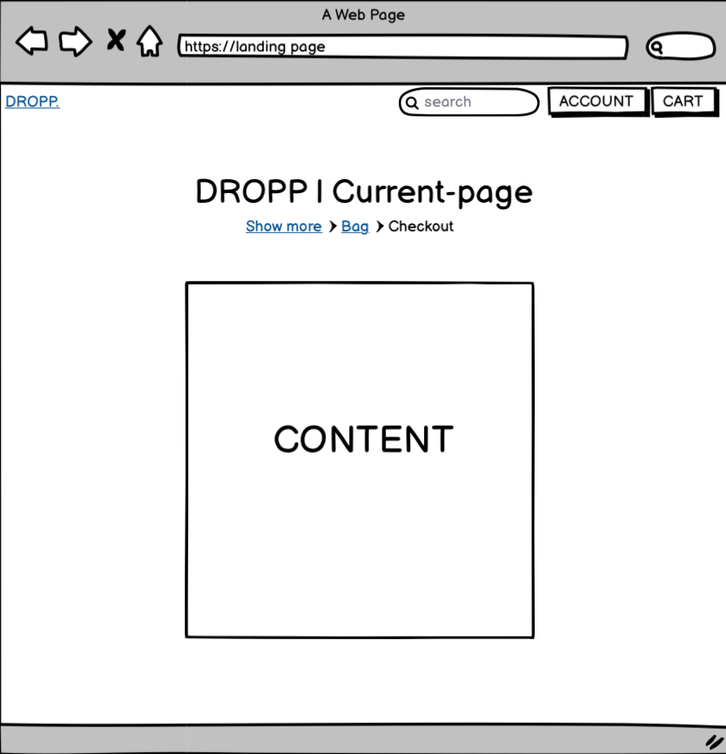
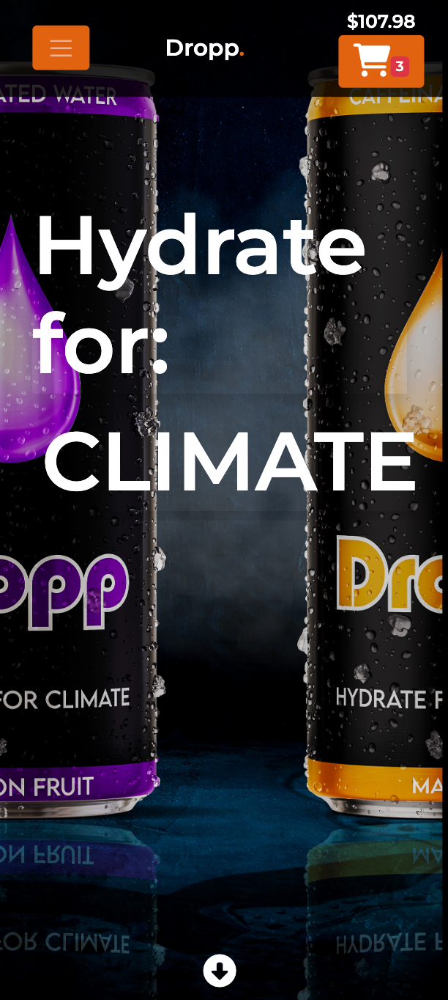
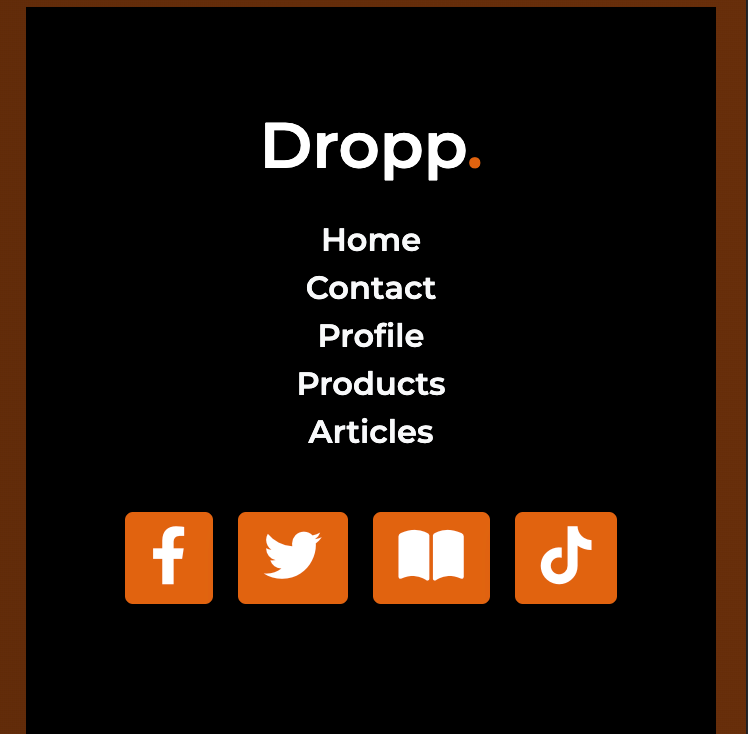
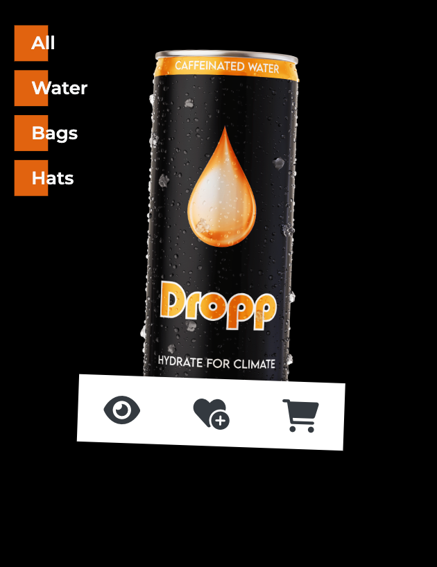
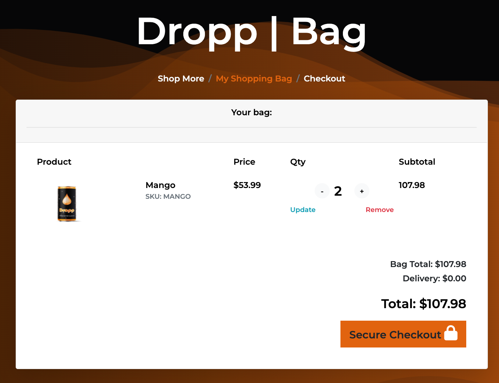
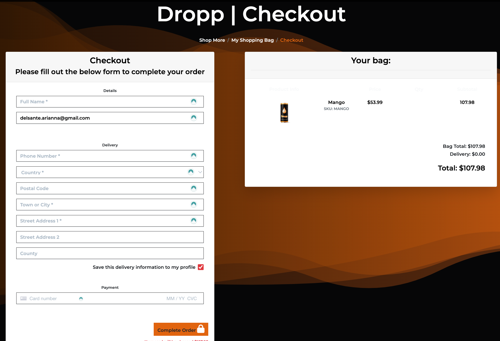
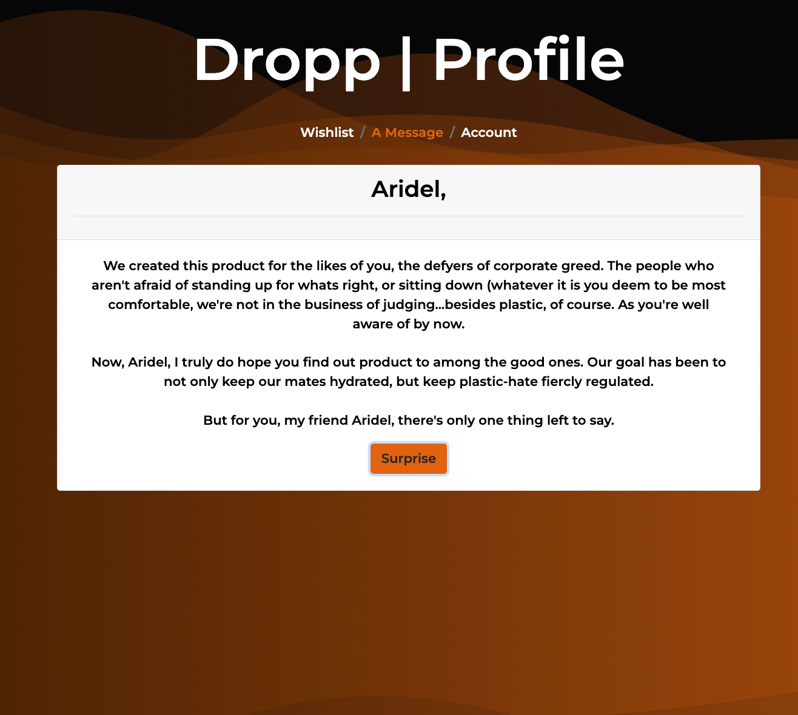
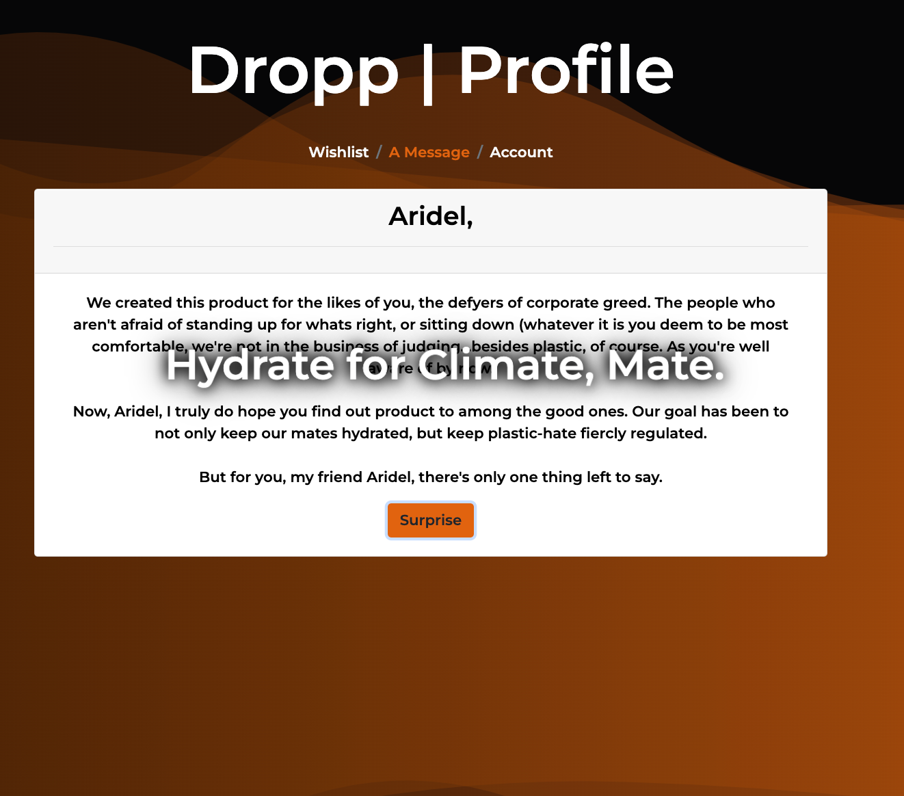
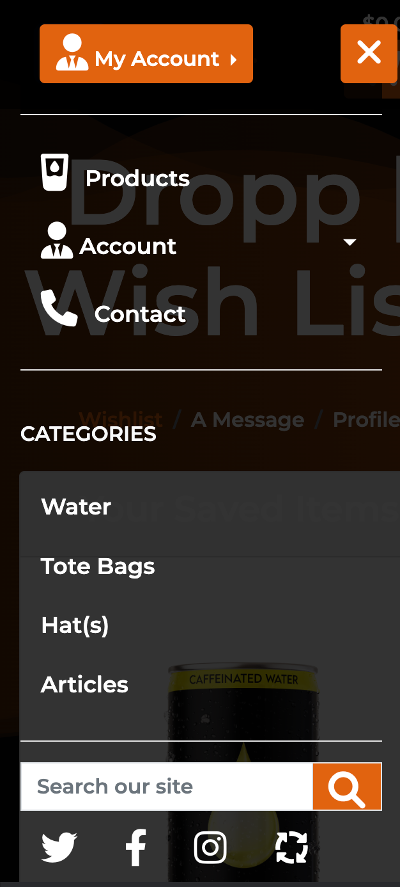

# canned-water


## About:
<hr>

Welcome to Dropp. Website! Dropp is an ecommerce platform, equipped with authentication (user-accounts) that not only sells its brand but also sells their products and merchandise. All using HTML, CSS(bootstrap), Javascript(jQuery), Python, Django, and deployment to Heroku with AWS holding the reigns of static files. Not to mention Stripe, the payment system integrated.

Live link: https://canned-water.herokuapp.com/

### Table of Contents

1. [UX](#ux)
   1. [Strategy](#strategy)
   2. [Design/Structure](#structure)
   3. [Databases](#databases)
   4. [Planning](#planning)
   5. [End Design](#end-design-result)
3. [Testing](#testing)
   1. [Manual Testing](#manual-testing)
   2. [Validator](#validator-testing)
   3. [Bugs](#unfixed-bugs)
   4. [Improvements](#improvements)
4. [Credits](#credits)

### User Stories

View my User Stories and planning [here](https://github.com/Marcroth0/relationship-quarrel/issues).

# UX

## Strategy

The initial and primary goal of the website is to create an e-commerce platform that looks great. This is not 100% dedicated to ecommerce, but to the brand itself. Sell the brand, sell the product. It allows a user to easily navigate the site and interact with the products via reviews, as well as the owners via the contact form.

Target Audience:

- 18-40 year olds
- People who are tired of plastic
- People who are environmentally friendly

The visitors are looking for a product that makes caring about the environment cool.

## Structure

Apps and their core functionality:

Checkout:<br>
Handle successful checkouts and saves order to userprofile,<br>
Validating checkout process,<br>
Caches the cart and user data, returns error of unvalid<br>

Connect:<br>
View to let users send email to owner of site

Home:<br>
A view to show individual product details through ajax<br>
A view for index<br>

Products:<br>
A view to show all products, including sorting and search queries<br>
A view to show individual product details<br>
Add/delete user reviews<br>
add/edit/delete products<br>

Profiles:<br>
Get and view userprofile including: Get and view order history<br>
Edit/add/delete Wishlist items.<br>

Bag:<br>
A view that renders the bag page<br>
Add a quantity of the specified product to the shopping bag<br>
Adjust the quantity of the specified product to the shopping bag<br>
Delete the item from the shopping bag<br>

Articles<br>
  Add, edit, and delete Articles/blogs<br>

### Databases:

### Models:

Articles, Models Post:<br>
title: Stores title of article<br>
author: Stores the author(ForeignKey) taken from User<br>
description = Stores the description of the Blog tied to user<br>
image: Imagefield<br>
body: The content<br>
date_published: Automatic date_published field<br>
featured_articles: Boolean field, if true = featured.<br>

Bag, Models Order/OrderlineItem:<br>
Stores all information about the order. The user information, such as address, email, phone number,<br> address etcetera - order information including price + delivery, products and quantity, and a <br>stripe_pid intent ID - ties all information to the user_profile.

Connect Models:<br>
email Stores information about used email<br>
title: Subject of email<br>
content: Content of email<br>

Profile:<br>
A user profile model for maintaining default<br>
delivery information(address, email, phone-number, etcetera) and order history<br>

Review:<br>
product: Stores the product with the related name of 'reviews', connected to user - both in foreignkeys.<br>
content: Stores content of review<br>
stars: stores the rate<br>
date_published: Stores when the review was published<br>

Below is a diagram of the correlation between the models:


Table outtake:

        Table "auth_user" {
          "id" integer [pk, not null]
          "password" varchar(128) [not null]
          "last_login" datetime
          "is_superuser" bool [not null]
          "username" varchar(150) [unique, not null]
          "last_name" varchar(150) [not null]
          "email" varchar(254) [not null]
          "is_staff" bool [not null]
          "is_active" bool [not null]
          "date_joined" datetime [not null]
          "first_name" varchar(150) [not null]
        }

        Table "products_category" {
          "id" integer [pk, not null]
          "name" varchar(254) [not null]
          "friendly_name" varchar(254)
        }

        Table "products_product" {
          "id" integer [pk, not null]
          "sku" varchar(254)
          "name" varchar(254) [not null]
          "description" text [not null]
          "price" decimal [not null]
          "rating" decimal
          "image_url" varchar(1024)
          "image" varchar(100)
          "category_id" bigint
          "featured_product" bool [not null]
        }

        Table "profiles_userprofile" {
          "id" integer [pk, not null]
          "default_phone_number" varchar(20)
          "default_country" varchar(2)
          "default_postcode" varchar(20)
          "default_town_or_city" varchar(40)
          "default_street_address1" varchar(80)
          "default_street_address2" varchar(80)
          "default_county" varchar(80)
          "user_id" integer [unique, not null]
        }

        Table "articles_post" {
          "id" integer [pk, not null]
          "title" varchar(100) [not null]
          "description" text [not null]
          "date_published" datetime [not null]
          "author_id" integer [not null]
          "body" text [not null]
          "image" varchar(100)
          "featured_articles" bool [not null]
        }

        Table "account_emailaddress" {
          "id" integer [pk, not null]
          "email" varchar(254) [unique, not null]
          "verified" bool [not null]
          "primary" bool [not null]
          "user_id" integer [not null]
        }

        Table "account_emailconfirmation" {
          "id" integer [pk, not null]
          "created" datetime [not null]
          "sent" datetime
          "key" varchar(64) [unique, not null]
          "email_address_id" integer [not null]
        }

        Table "checkout_order" {
          "id" integer [pk, not null]
          "order_number" varchar(32) [not null]
          "full_name" varchar(50) [not null]
          "email" varchar(254) [not null]
          "phone_number" varchar(20) [not null]
          "country" varchar(2) [not null]
          "postcode" varchar(20)
          "town_or_city" varchar(40) [not null]
          "street_address1" varchar(80) [not null]
          "street_address2" varchar(80)
          "county" varchar(80)
          "date" datetime [not null]
          "delivery_cost" decimal [not null]
          "order_total" decimal [not null]
          "grand_total" decimal [not null]
          "original_bag" text [not null]
          "stripe_pid" varchar(254) [not null]
          "user_profile_id" bigint
        }

        Table "checkout_orderlineitem" {
          "id" integer [pk, not null]
          "quantity" integer [not null]
          "lineitem_total" decimal [not null]
          "order_id" integer [not null]
          "product_id" bigint [not null]
        }

        Table "profiles_wishlist" {
          "id" integer [pk, not null]
          "created_on" datetime [not null]
          "user_wish_id" bigint [not null]
          "product_id" bigint [not null]
        }

        Table "products_productreview" {
          "id" integer [pk, not null]
          "content" text
          "stars" integer [not null]
          "user_id" integer [not null]
          "product_id" bigint [not null]
          "date_published" datetime [not null]
        }

### Planning

I wireframed it using Balsamiq:

Landing page:


Structure:


Products Page:


I had the initial idea in my head to make it visually appealing, considering the goal was to make an ecommerce for the Company with few products where the brand was in focus. The breadcrumbs througout the page, going from products/bag/checkout, and wishlist/profile/order history was my tree-branch.

### End Design Result:

Easily navigated navbar which contains(logged in) account management(profile/orders/ability to post a review/see their saved wishlist)

Navbar:


Navbar(Mobile):


Landing page is a cooperation between the hero-image and the words changing between "Hydrate for: PLASTIC-HATE, CLIMATE, YOU, MATE". Instantly the visitor gets questions answered:

1. What the point of the site is
2. Laughing at "you, mate"
3. That it is a brand for caffeinated water and it's environmentally friendly

These three points together form a need to be included.

Hero:
The Hero image, as mentioned above, is 

<details><summary>Hero Image</summary>


</details>
<br>
Hero - Mobile:
<details><summary>Hhero Image(mobile)</summary>



</details>
<br>

Just water: Portraying the message instantly, claiming the company is looking after the environment. Setting up the theme instantly. 

<details><summary>Just f*uc*ing water</summary>


</details>

<details><summary>Just f*uc*ing water(mobile)</summary>


</details>
<br>

<details><summary></summary>


</details>
<br>

Featured products:
The owner has the ability of portraying featured products that will show up on the front page. You're able to set as many featured to True, however the recommendation is to keep it at 4. To leave the possibility open, I decided to keep that functionality out. 

<details><summary>Featured Products</summary>


</details>

<details><summary>Featured Products(mobile)</summary>


</details>
<br>

<details><summary>Quick view</summary>


</details>
<br>

Featured Articles:
The same functionality goes with the articles. Either you set featured to True, which will make them end up in the index.html, or you keep it in the "View all articles" template.

<details><summary>Featured Articles</summary>


</details>
<br>

<details><summary>Featured Articles(mobile)</summary>


</details>
<br>

Footer: 
Footer is simple, but effective. Giving the the core functionality in links: Home, Contact, Profile, Products, Articles
As well as links to social media sites. I left out the side to let the moving background keep flowing. 

<details><summary>Footer</summary>


</details>
<br>

<details><summary>Footer(mobile)</summary>



</details>
<br>

## Products

Product page: 
A fully reponsive page, which menu-bar narrows to be compatible with all mobiles. In case more products are added I added the functionality of an additional menu-bar activated on scroll. 


<details><summary>Products</summary>


</details>
<br>

<details><summary>Products(mobile)</summary>



</details>
<br>

<details><summary>Products(scroll)</summary>


</details>
<br>

## Product Details

Product details:
The user finds every necessary information about the product: Price, description, name, image, ability to att to wishlist, increment/decrement between how many to purchase and of course add to bag. As well as (if authenticated) post a review with a rating between 1.5 which will be automatically averaged and applied to the top. 


<details><summary>Products Details</summary>


</details>
<br>

<details><summary>Products Details(mobile(1))</summary>


</details>
<br>

<details><summary>Products Details(mobile(2))</summary>


</details>
<br>

<details><summary>Products Details(mobile(3))</summary>


</details>
<br>

## Checkout 

Bag: 
The user, after adding a product, will find it in their bag. Here, as well, being able to increment/decrement before moving to Checkout, which they can do either through the breadcrumb up top or via "Secure Checkout"

<details><summary>Bag </summary>



</details>
<br>

<details><summary>Bag(mobile)</summary>


</details>
<br>

Checkout: 

<details><summary>Checkout</summary>



</details>
<br>

<details><summary>Checkout(mobile(1))</summary>


</details>
<br>

<details><summary>Checkout(mobile(2))</summary>


</details>
<br>

Checkout Success: 


<details><summary>Checkout Success</summary>


</details>
<br>

<details><summary>Checkout Success(mobile(1))</summary>


</details>
<br>

<details><summary>Checkout Success(mobile(1))</summary>


</details>
<br>

## Profile

Profile:
Entire profile is navigated through breadcrumbs, showing Wishlist/Surprise/Profile. Profile containing valuable information such as address and information(saved from checkout). Surprise contains, well, a surprise; a continuing joke. Wishlist contains each item the user has saved to their account. 

<details><summary>Profile</summary>


</details>
<br>

<details><summary>Surprise</summary>



</details>
<br>

<details><summary>Surprise 2</summary>



</details>
<br>

<details><summary>Wishlist</summary>



</details>
<br>


### Color Palette

Colors:


### Reasoning

The design of the website was crucial. It being an ecommerce site with all its functionality, it was still leaning towards its branding. Being cool, but environmentally friendly. 

### Fonts

font-family: 'Montserrat', sans-serif;
<br>
For index.html: font-family: "Codystar", cursive;

## User abilities

User, not logged in:
- View products, articles

User, logged in: 
- Access to Profile including Wishlist, ability to save delivery-information, ability to leave reviews.

Superuser(owner):
- Above abilities. In addition: Through the front end create, edit, and delete: Articles, Products, adding both images as well as whether they should be featured or not. 

## Testing

See further thorough [here](readme-files/testing/readme-testing)

I tested the responsiveness of the site on the devices currently offered by chrome Devtools, as well as on a MacBook Pro 13", and Macbook Pro 14", and a iMac 27". Cellphones tried are iPhone 12.


## Technologies used:

- I used [Python](https://www.python.org/) to write my functions and models
- I used [jQuery](https://jquery.com/) to write front-end functions
- I used [Javascript](https://www.javascript.com/) to write front-end functions
- I used [Ajax](https://www.w3schools.com/js/js_ajax_intro.asp)

- [Django](https://www.djangoproject.com/) is the framework used to build project and its apps

- [AWS](https://cloudinary.com/) has been used to store my images and static files

- [Crispyforms](https://django-crispy-forms.readthedocs.io/en/latest/) has been used to easily display forms

- [Github](https://github.com/) Has been to store and plan project

- [Vscode](https://code.visualstudio.com/) my choice of IDE

- [PostgreSQL](https://www.postgresql.org/) Database

- [SQlite](https://www.sqlite.org/index.html) has been used for local testing

- [Pep8](https://pypi.org/project/autopep8/) has been used for formatting and error-checking python-code

- [Prettier](https://marketplace.visualstudio.com/items?itemName=esbenp.prettier-vscode) has been used for formatting and error-checking html-code

- [ImgBot](https://imgbot.net/) - my trustworthy companion for optimizing size of images

- [Google-Developer-Tools](https://developers.google.com/web/tools) - for debugging

- [Bootstrap4](https://getbootstrap.com/) - css library

- [AmIResponsive](http://ami.responsivedesign.is/#) - used to check responsiveness, and collect image you find at the top of page.

## Features Left to Implement

## Deployment

This project was developed using Visual Studio Code, via GitHub as a repository and is hosted on Heroku with the database of PostgreSQL. In order to create a repository from GitHub follow these intructions: 
1. Fork this GitHub repository
2. Clone said repository and type in the below code into your command-line:<br>
    `$ git clone https://github.com/YOUR-USERNAME/YOUR-REPOSITORY`
3. Install all dependencies using the below code:<br>
    `pip3 install -r requirements.txt`
4. Create a .gitignore and a env.py file and add last mentioned to it. This will prevent secret code from being commited to public places. 
5. Inside the env.py file fill in the below missing code: <br>
        - ```
            import os

            os.enviorn["DEVELOPMENT"] = True
            os.environ["SECRET_KEY"] = "Your secret key"
            os.environ["STRIPE_PUBLIC_KEY"] = "Your stripe public key"
            os.environ["STRIPE_SECRET_KEY"] = "Your stripe secret key"
            os.environ["STRIPE_WH_SECRET"] = "Your stripe webhook secret key"
            ```

Stripe keys can be found by setting up your free account at Stripes website. 

7. Setup the database by migrating the database models by typing the following commands into the terminal: 
    - ```
        python3 manage.py showmigrations
        python3 manage.py makemigrations
        python3 manage.py migrate
        ```

8. To load the product/categories fixtures into the database type the below code into the terminal:
    - ```
        python3 manage.py loaddata products
        python3 manage.py loaddata categories
        python3 manage.py loaddata brands
        ```

9. Now, Create a superuser to have access to the django admin dashboard by typing in the following command into the terminal:
    - ```
        python3 manage.py createsuperuser
        ```
    - Then set up the account by adding your username, email and password. 

10. Finally, run the app locally by typing the following command into the terminal: 
    - ```
        python3 manage.py runserver

Deploy to Heroku:

1. Create a Heroku app: 
    - Go to [Heroku](https://www.heroku.com/), create an account and from the dashboard set up a Postgres Database. You can simply search for it and choose the hobby-version.
    - On the resources tab set up a new Postgres database by searching for 'Postgres'.
2. On your IDE, install 'dj_database_url' & 'psycopg2' to enable the use of the Postgres database: 
    - In the terminal type the following commands:
        - ```
            pip3 install dj_database_url
            pip3 install psycopg2-binary
            ```
3. Add the dependencies to the requirements file:
    - ```
        pip3 freeze > requirements.txt
        ```
4. To setup the database go to to settings.py, import 'dj_database_url', comment out the default database configuration and replace the default database with the following: 
    - ```
        import dj_database_url

        DATABASES = {
            'default': dj_database_url.parse("The URL of your Heroku Postgres database")
        }
        ```
5. Run all migrations to the new Postgres database by first entering this command in your terminal: 

      - ```
        python3 manage.py makemigrations
        ```
  - Followed by: 

    - ```
        python3 manage.py migrate
        ```

6. Create a superuser:
    - ```
        python3 manage.py createsuperuser
        ```

7. In settings.py set up the following to use the Postgres database when the app is running on Heroku and the SQLite3 when the app is running locally:
    - ```
        if 'DATABASE_URL' in os.environ:
            DATABASES = {
                'default': dj_database_url.parse(os.environ.get('DATABASE_URL'))
            }
        else:
            DATABASES = {
                'default': {
                    'ENGINE': 'django.db.backends.sqlite3',
                    'NAME': BASE_DIR / 'db.sqlite3',
                }
            }
        ```
9. Install Gunicorn by typing the following the below command into your terminal:
    - ```
        pip3 install gunicorn
        pip3 freeze > requirements.txt
        ```
10. Create a procfile by typing the following command into the terminal:
    - ```
        touch Gunicorn
        ```
11. Type the following into the procfile: 
    - ```
        web: gunicorn flame.wsgi:application
        ```
12. Login to Heroku terminal:
    - ```
        heroku login -i
        ```
13. Disable collectstatic to prevent Heroku from collecting static files when deployed: 
    - ```
        heroku config:set DISABLE_COLLECTSTATIC=1 --app "heroku_app_name"
        ```
14. In settings.py add the hostname of the Heroku app, and allow localhost: 
    - ```
        ALLOWED_HOSTS = ['"heroku_app_name".herokuapp.com', 'localhost']
        ```
15. Deploy to Heroku: 
    - ```
        heroku git:remote -a "heroku_app_name"
        git push heroku main
        ```
16. Set debug to be true only if there's a variable called "DEVELOPMENT" in the environment. 
    - ```
        DEBUG = 'DEVELOPMENT' in os.environ
        ```

Connecting to AWS:

1. From the services menu go to IAM.
2. From the Access Management dropdown select 'User Groups'. 
    - Click the 'Create New Group" button
    - Name your group (associated with the S3 Bucket name)
    - Click 'Next' until the last page, then click the 'Save' button. 
3. From the Access Management dropdown select 'Policies'
    - Click the 'Create Policy' button: 
        - Go to the JSON tab and click 'Import Managed Policy'
        - Search for S3 then select 'AmazonS3FullAccess' and click "Import".
        - Get the ARN from the S3 bucket policy page and paste it in the "Resource" field as a list. Add two ARN's, one for the bucket itself and another for all files and folders in the bucket ("/*" at the end of the string): 
            - ```
                {
                    "Version": "2012-10-17",
                    "Statement": [
                        {
                            "Effect": "Allow",
                            "Action": [
                                "s3:*",
                                "s3-object-lambda:*"
                            ],
                            "Resource": [
                                "arn:aws:s3:::milestone-project-4-flame",
                                "arn:aws:s3:::milestone-project-4-flame/*"
                            ]
                        }
                    ]
                }
                ```
        - Click the "Review Policy" button and give the policy a name and description and click the "Create Policy" button.
4. Go back to the "User Groups" page:
    - Click the group you want to attach the policy to and click "Attach policy" 
    - Search for the policy that has been created and attach it.
5. From the Access Management dropdown click "Users" > "Add Users" : 
    - Enter a user name and select the "Programmatic access' checkbox and select next
    - On the next page add the user to the group that was created and click through the end to create the user. 
    - Once the user is created download the CSV file containing the user's access key and secret access key (needed to authenticate the user from the Django app). 

### Connect Django to S3

1. Connecting S3 bucket to django by installing thesee packages and add them to the requirements file:
    - ```
        pip3 install boto3
        pip3 install django_storages
        ```

2. Update settings.py file to tell Django which bucket it should be communicating with: 
    - ```
        if 'USE_AWS' in os.environ:
            AWS_STORAGE_BUCKET_NAME = 'milestone-project-4-flame'
            AWS_S3_REGION_NAME = 'eu-north-1'
            AWS_ACCESS_KEY_ID = os.environ.get('AWS_ACCESS_KEY_ID')
            AWS_SECRET_ACCESS_KEY = os.environ.get('AWS_SECRET_ACCESS_KEY')
            AWS_S3_CUSTOM_DOMAIN = f'{AWS_STORAGE_BUCKET_NAME}.s3.amazonaws.com'

            STATICFILES_STORAGE = 'custom_storages.StaticStorage'
            STATICFILES_LOCATION = 'static'
            DEFAULT_FILE_STORAGE = 'custom_storages.MediaStorage'
            MEDIAFILES_LOCATION = 'media'

            STATIC_URL = f'https://{AWS_S3_CUSTOM_DOMAIN}/{STATICFILES_LOCATION}/'
            MEDIA_URL = f'https://{AWS_S3_CUSTOM_DOMAIN}/{MEDIAFILES_LOCATION}/'
        ```
    - In Heroku update the config variables: 
        - USE_AWS =  True 
        - AWS_ACCESS_KEY_ID = from IAM CSV file
        - AWS_SECRET_ACCESS_KEY = from IAM CSV file
    - Remove the DISABLE_COLLECTSTATIC variable to allow django to collect static files and upload them to S3. 
3. Create a custom_storages.py file:
    - ```
        from django.conf import settings
        from storages.backends.s3boto3 import S3Boto3Storage


        class StaticStorage(S3Boto3Storage):
            location = settings.STATICFILES_LOCATION


        class MediaStorage(S3Boto3Storage):
            location = settings.MEDIAFILES_LOCATION
        ```


## Credits

- A general shout-out to [StackOverflow](https://stackoverflow.com/), which solved a lot of issues and gave a lot of answers. Always a key website for inspiration and working code. 
- Credit for images used in posts [chikenbugagashenka]
- Credit to this fellow gentlemen which automated code I took great inspiration from [here](https://github.com/BrianWhelanDublin/milestone-project-4)
- Credit to [Freefrontend](https://freefrontend.com/) from which I took inspiration from when it came to the Sidebar as well as 

- [dbdiagram](https://dbdiagram.io/) for offering a database-visualiser.
